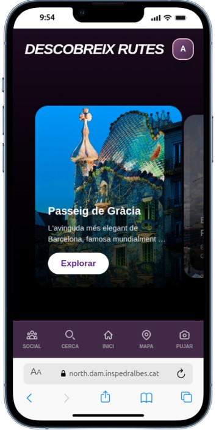

# North - Explora Barcelona

[](https://github.com/inspedralbes/projecte-final-2025-26-dam-g2_tf/actions/workflows/ci.yml)
[](https://nodejs.org/)
[](https://vuejs.org/)
[](https://www.mongodb.com/)
[](https://www.docker.com/)
[](./LICENSE)

## Descripció i Context

**North** és una plataforma interactiva de descobriment urbà que gamifica l'exploració de Barcelona. Resol la falta de connexió històrica i cultural mitjançant rutes interactives, col·leccionisme de cromos digitals i desafiaments en temps real validats per Intel·ligència Artificial.

## Taula de Continguts

1. [Demostració Visual](#demostració-visual)
2. [Característiques Principals](#característiques-principals)
3. [Tecnologies Utilitzades](#tecnologies-utilitzades)
4. [Arquitectura del Sistema](#arquitectura-del-sistema)
5. [Documentació i Gestió](#documentació-i-gestió)
6. [Documentació Tècnica](#documentació-tècnica)
7. [Guia d'Instal·lació](#guia-dinstallació)
8. [Proves (Testing)](#proves-testing)
9. [Autors](#autors)

## Demostració Visual

.png>) 

**ANUNCI DE NORTH:** [`Vídeo d'anunci de North`](https://youtu.be/LYxOGJ71YcE)

 **DEMO DEL PROJECTE:** [`Vídeo-Demo del Projecte`](https://drive.google.com/file/d/1D9yYe8ZAUiyYibALjy0bfN736tjsxKbO/view?usp=sharing )

**Fluxe de l’aplicació:** [`Fluxe de l’aplicació`](./doc/resum_2526_Grup2ProjecteNorth.pdf)

## Característiques Principals

* **Mapa Interactiu:** Visualització de POIs amb Leaflet i geolocalització en temps real.
* **Sistema de Cromos:** Col·leccionisme d'actius digitals basats en fites històriques de Barcelona.
* **Validació per IA:** Reconeixement d'imatges amb TensorFlow/MobileNet per verificar visites.
* **Multijugador:** Partides individuals i en grup amb sales en temps real via Socket.io.
* **Xarxa Social:** Feed de posts, comentaris, likes, amics i rànquing global.
* **Control Horari:** Restriccions dinàmiques d'accés (toc de queda) per a la seguretat.
* **App Mòbil:** Versió Android nativa generada amb Capacitor.

## Tecnologies Utilitzades

| Capa | Tecnologies |
| --- | --- |
| **Frontend** | Vue 3, Vite, Tailwind CSS 4, Leaflet |
| **Backend** | Node.js, Express 5, Socket.io 4 (Temps real) |
| **IA** | TensorFlow.js, MobileNet v2 (validació de fotos) |
| **Base de Dades** | MongoDB Atlas, Mongoose 9 |
| **Mòbil** | Capacitor 8 (Android/iOS) |
| **Infraestructura** | Docker, Docker Compose, Nginx, Let's Encrypt |
| **Testing** | Jest, Supertest, Vitest, Vue Test Utils |
| **CI/CD** | GitHub Actions |

## Arquitectura del Sistema

El sistema utilitza una arquitectura de microserveis orquestrada per Docker, amb un proxy invers Nginx que gestiona el trànsit SSL i redirigeix les peticions al frontend o a l'API.

## Documentació i Gestió

* **Prototip Gràfic:** [Figma - Projecte North](https://www.figma.com/design/ZWvk9y8fxNVV3Vw7hg25Gw/Proyecto-Final?node-id=0-1&t=s7b8GKnuTR6dvyrY-1)
* **Gestió de Tasques:** [Taiga Backlog](https://tree.taiga.io/project/mxrta22-brujula-projecte-final/backlog)
* **URL de Producció:** [north.dam.inspedralbes.cat](https://north.dam.inspedralbes.cat)

## Documentació Tècnica

Aquesta secció serveix com a punt d'entrada per a qualsevol desenvolupador que vulgui col·laborar. Per a especificacions detallades, consulta la carpeta [`/doc`](./doc/).

### 1. Organització del Codi

* **Backend (`/backend`):** Estructura modular on les rutes es divideixen per dominis funcionals (auth, social, mapa, etc.) carregats al servidor principal.
* **Frontend (`/frontend`):** SPA organitzada en components i pàgines de Vue, amb un sistema de rutes que inclou guàrdies de navegació per a administradors i usuaris autenticats.

### 2. Models de Dades (Mongoose)

Les entitats principals estan definides a `backend/src/models/index.js`:

* `Usuari`: Credencials i estat de verificació.
* `Perfil`: Dades de gamificació, inventari de cromos i relacions socials.
* `Lloc`: Definició de punts al mapa i missions associades.
* `SessioJoc`: Gestió de l'estat de les partides actives.

### 3. Comunicació en Temps Real

El sistema utilitza **Socket.io** per sincronitzar l'estat del joc entre múltiples jugadors, configurat centralment per gestionar esdeveniments de sala i progrés.

## Guia d'Instal·lació

```bash
# 1. Clonar el repositori
git clone https://github.com/inspedralbes/projecte-final-2025-26-dam-g2_tf.git
cd projecte-final-2025-26-dam-g2_tf

# 2. Configurar .env (basat en docker-compose.yml)
# NODE_ENV=development
# PORT=8088
# ORIGIN_URL=http://localhost:8081

# 3. Aixecar amb Docker
docker compose -f docker-compose.dev.yml up --build

```

## Proves (Testing)

Suite automatitzada integrada en el flux de CI/CD:

```bash
# Backend (Jest)
cd backend && npm test

# Frontend (Vitest)
cd frontend && npm test

```

## Estructura del Projecte

```
├── backend/          # API REST + Socket.io + IA
│   ├── src/
│   │   ├── routes/   # Endpoints per dominis (auth, social, mapa...)
│   │   ├── models/   # Esquemes Mongoose (Usuari, Perfil, Lloc...)
│   │   ├── utils/    # Cron jobs, control horari
│   │   └── config/   # Connexió MongoDB
│   └── public/       # Fitxers estàtics (fotos, cromos, personatges)
├── frontend/         # SPA Vue 3 + Capacitor
│   ├── src/
│   │   ├── pages/        # Vistes principals
│   │   ├── components/   # Components reutilitzables
│   │   ├── composables/  # Lògica compartida
│   │   └── router/       # Rutes + guàrdies de navegació
│   └── android/      # Projecte Android (Capacitor)
├── proxy/            # Configuració Nginx
├── doc/              # Documentació tècnica i diagrames
└── docker-compose.yml
```

## Autors

* **Judit Sarrat Andújar**
* **Fiona Mondelo Giaramita**
* **Marta Haro Font**
* **Fabrizzio Rodriguez González**

## Llicència

Aquest projecte està llicenciat sota la [Apache License 2.0](./LICENSE).

---
